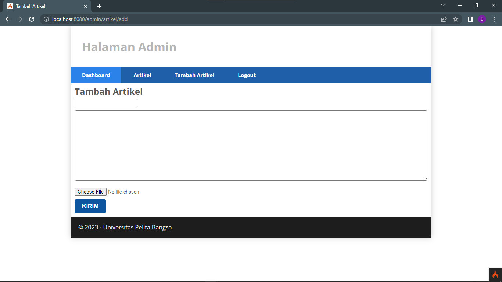

# Lab11Web

# <P align="center"> HI, WELCOME TO MY REPOSITORIES!


# <p align="center">Praktikum 11: Upload File Gambar</p>

### Tujuan

- Mampu memahami konsep dasar _File Upload_.
- Mampu membuat file upload dengan program sederhana menggunakan _Framework Codeigniter4_.

### Instruksi Praktikum

- Persiapkan text editor misalnya VSCode.
- Buat folder baru dengan nama lab11_php_ci pada docroot webserver (htdocs)
- Ikuti langkah-langkah praktikum yang akan dijelaskan berikutnya.

---

# <p align="center">Langkah-langkah Praktikum</p>

**_Buka kembali Controller Artikel pada project sebelumnya, sesuaikan kode pada method add seperti berikut._**

```php
public function add()
{
// validasi data.
$validation = \Config\Services::validation();
$validation->setRules(['judul' => 'required']);
$isDataValid = $validation->withRequest($this->request)->run();
if ($isDataValid)
{
$file = $this->request->getFile('gambar');
$file->move(ROOTPATH . 'public/gambar');
$artikel = new ArtikelModel();
$artikel->insert([
'judul' => $this->request->getPost('judul'),
'isi' => $this->request->getPost('isi'),
'slug' => url_title($this->request->getPost('judul')),
'gambar' => $file->getName(),
]);
return redirect('admin/artikel');
}
$title = "Tambah Artikel";
return view('artikel/form_add', compact('title'));
}
```

**_Kemudian pada file views/artikel/form_add.php tambahkan field input file seperti berikut._**

```html
<p>
  <input type="file" name="gambar" />
</p>
```

**_Sesuaikan tag form dengan menambahkan ecrypt type seperti berikut._**

```html
<form action="" method="post" enctype="multipart/form-data"></form>
```

## Ujicoba file upload dengan mengakses menu tambah artikel.



---

# <P align="center"> THANK YOU!